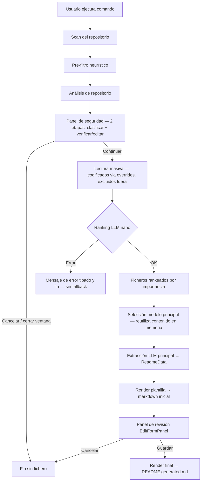

# CLAUDE.md — Readme-Generator AI

> Contexto persistente para agentes Claude. Lee este fichero completo antes de realizar cualquier cambio en el repositorio.

---

## 1. Propósito del proyecto

**Readme-Generator AI** es una extensión de VS Code que automatiza la creación y el mantenimiento de documentación técnica para proyectos software existentes mediante Azure OpenAI. Tiene **dos modos**, cada uno con su comando:

- **Generar** (`readmeGeneratorAi.generateReadme`): crea un `README.generated.md` desde cero analizando el repositorio.
- **Actualizar** (`readmeGeneratorAi.updateReadme`): EDITA un README existente sin regenerarlo — compara campo a campo lo que dice el README con lo que dice el código, propone cambios y solo parchea los que el humano aprueba, conservando intacto el resto del documento (ver §15).

Puntos clave del diseño:

- Es una herramienta de **propósito general**: documenta proyectos de **cualquier tipo** (APIs/servicios, librerías/SDKs, CLIs, extensiones, apps web, servicios batch, etc.). Tiene **soporte reforzado para proyectos conversacionales / de IA / LLM-RAG**: la plantilla incluye secciones específicas (Conocimiento y prompts, Experiencia de usuario conversacional) que el modelo rellena **solo si hay evidencia** de un componente de IA y deja vacías en caso contrario.
- El proceso combina análisis heurístico del repositorio con dos llamadas a Azure OpenAI: un modelo ligero (nano) que lee todo el repositorio y genera un ranking de ficheros por importancia, y un modelo potente que lee los ficheros más importantes y extrae la información estructurada.
- Antes de enviar contenido a cualquier modelo, la extensión detecta ficheros sensibles (`.env`, material criptográfico, ficheros de credenciales) y muestra un panel interactivo de dos etapas donde el usuario decide, por fichero, si se **codifica** (se ocultan sus valores), se **excluye** por completo o se envía tal cual; en la segunda etapa puede revisar y editar a mano lo codificado antes de que salga nada.
- El usuario puede revisar y completar la información antes de generar el README final a través de un panel interactivo en VS Code.
- El proyecto está **en desarrollo activo** y aún no está distribuido públicamente.
- Toda la salida (README generado, prompts, plantilla, UI) está en **español**.

---

## 2. Tech stack y dependencias críticas

| Tecnología | Versión | Rol |
|---|---|---|
| TypeScript | 5.5.4 | Lenguaje principal, strict mode, ES2022, CommonJS |
| VS Code Extension API | ^1.92.0 | Plataforma de la extensión |
| Azure OpenAI Responses API | — | LLM para selección de ficheros y extracción de datos |
| `vsce` | ^2.31.1 | Empaquetado y publicación de la extensión |
| `vitest` | ^4.1.10 | Testing (tests unitarios de la lógica pura) |
| Node.js | ^20 | Runtime |

**Dependencias de producción**: **ninguna**. El render es un parser/renderer propio (`templateSpec.ts` + `templateRenderer.ts`); `nunjucks` y `@types/nunjucks` se eliminaron por completo de `package.json` y del lockfile. El resto son devDependencies o APIs de VS Code. *(El analizador detecta "Nunjucks" como tecnología del repo analizado en `repositoryAnalyzer.ts`, pero eso no implica ninguna dependencia de esta extensión.)*

**Sí hay tests**: suite de **Vitest** (`*.test.ts` junto a cada módulo; ~169 tests) que cubre la lógica pura — parser de plantilla, scanner, redactor de secretos, modelo de revisión, cliente Azure (parseo), pipeline de escenarios y utilidades. La UI webview y la integración con Azure se prueban a mano (F5). Comandos: `npm test` (una pasada) y `npm run test:watch`.

**No hay**: ESLint, Prettier, Redux ni ningún gestor de estado externo.

---

## 3. Estructura del repositorio

Los ficheros `*.test.ts` (Vitest) viven junto al módulo que prueban y se omiten del árbol por brevedad.

```
Readme-Generator/
├── src/                          # Código fuente TypeScript
│   ├── extension.ts              # Entry point: registra los 4 comandos y orquesta ambos flujos (generar + actualizar)
│   ├── config.ts                 # Lectura y validación de VS Code settings
│   ├── types.ts                  # Interfaces compartidas (ReadmeData, ExtensionSettings, TokenUsage)
│   ├── azure/
│   │   └── azureResponsesClient.ts  # HTTP client — preSelectImportantFiles() (nano), extractReadmeData() (principal), callWithSchema() y completeText() (los usa el actualizador)
│   ├── prompt/
│   │   ├── fileSelectionPrompt.ts   # buildContentSelectionPrompt() para el nano + getFileSelectionJsonSchema()
│   │   └── promptBuilder.ts         # buildExtractionPrompt() (acepta scopePaths para el actualizador) + getExtractionJsonSchema()
│   ├── scanner/
│   │   ├── fileScanner.ts           # scanRepository(), buildFileInventory(), readAllCandidateFiles(), readRawContent(), splitByTokenBudget(); constantes MAX_FILE_BYTES y PRE_SELECTION_MAX_BYTES_PER_FILE
│   │   ├── repositoryAnalyzer.ts    # Detección de stack tecnológico, módulos, entrypoints
│   │   └── types.ts                 # Tipos del scanner (CandidateFile, SelectedFile, RepositoryMap, ReadDepth, etc.)
│   ├── pipeline/                    # Memoria de ranking (base del actualizador incremental, ver §11 y §15)
│   │   ├── rankingMemory.ts         # loadRankingMemory()/saveRankingMemory() (ranking + seenPaths + fileHashes) y hashContent()
│   │   └── rankingInsertion.ts      # Inserción incremental de ficheros nuevos/cambiados en un ranking previo (prompt + merge mecánico)
│   ├── update/                      # Modo ACTUALIZAR — aislado del generador (ver §15)
│   │   ├── updatePipeline.ts        # Pasos puros: extractReadmeFichas, extractCodeFichas, compareFichas, reconcileSuspects, applyApprovedChanges, extractHeadings…
│   │   ├── readmeFichasPrompt.ts    # Prompt de extracción PURA del README (paso 1)
│   │   ├── comparePrompt.ts         # Prompt+schema de comparación ficha README vs código (paso 3)
│   │   ├── reconcilePrompt.ts       # Prompt+schema de reconciliación de sospechosos (paso 4)
│   │   ├── applyPrompt.ts           # Prompt de aplicación puntual de cambios al README (paso 6)
│   │   ├── fichaUtils.ts            # get/format/parse/isEmpty de "fichas" (valores por campo)
│   │   └── updateReviewPanel.ts     # Panel webview de revisión de cambios (paso 5)
│   ├── readme/
│   │   └── reviewModel.ts           # Análisis de campos vacíos/pendientes y opciones de render (campos derivados del parser de la plantilla)
│   ├── template/
│   │   ├── templateSpec.ts          # Parser de la plantilla: extrae tokens [[ ruta | ROL | tipo? | instrucción ]], fuente única de estructura, schema, instrucciones y secciones del panel
│   │   └── templateRenderer.ts      # Renderer propio (sin Nunjucks): sustituye tokens por valores, aplica omitFields/omitSections y placeholders
│   ├── trace/
│   │   └── generationTrace.ts       # Traza de generación → almacenamiento privado de la extensión (storageDir)
│   ├── storage/
│   │   └── extensionStorage.ts      # resolveStorageDir(): carpeta privada por-workspace fuera del repo (ver §11)
│   ├── ui/
│   │   ├── budgetWarningPanel.ts    # Panel webview para ficheros fuera del presupuesto de tokens
│   │   ├── editFormPanel.ts         # Panel webview de revisión del generador: formulario + preview en tiempo real (ver §9)
│   │   ├── securityReviewPanel.ts   # Panel webview de protección de datos sensibles (ver §10)
│   │   └── webviewHtml.ts           # Helpers compartidos de los paneles (getNonce())
│   └── utils/
│       ├── errors.ts                # asErrorMessage() + describePreSelectionError() (mensaje tipado por error de Azure, ver §7)
│       ├── secretRedactor.ts        # Capa de seguridad: isEnvFile(), classifySensitiveFile(), redactSecrets(), countRedactions() (ver §10)
│       ├── json.ts                  # safeJsonParse()/extractJsonObject() (parseo tolerante compartido)
│       ├── objectPath.ts            # getValueAtPath() (lectura por ruta "a.b.c", compartida)
│       └── text.ts                  # indent() (formato de bloques en los prompts del actualizador)
├── templates/
│   └── readme.template.md           # Plantilla Markdown del README (12 secciones). Legible por humanos y fuente única de instrucciones. Token: [[ ruta | ROL | tipo? | instrucción ]]
├── dist/                            # Compilado TypeScript (no editar manualmente)
├── package.json                     # Metadatos, 4 comandos VS Code, configuración de la extensión
├── tsconfig.json                    # Configuración TypeScript
└── vitest.config.ts                 # Configuración de la suite de tests (Vitest)
```

---

## 4. Arquitectura y flujo de datos

Esta sección describe el flujo de **GENERAR** (`readmeGeneratorAi.generateReadme`); el flujo de **ACTUALIZAR** se documenta en §15 y reutiliza las fases 1-7 vía `prepareRepositoryContext()`. El flujo de generación pasa por 9 fases secuenciales. El pipeline usa **dos modelos LLM distintos**: un modelo ligero (nano) para el ranking de ficheros y un modelo potente para la extracción de datos. Antes de cualquier llamada LLM se ejecuta la fase de protección de datos sensibles.



### Detalle de cada fase

**Fase 1 — Scan** [`src/scanner/fileScanner.ts` → `scanRepository()`]
- Descubre todos los ficheros (`**/*`) y filtra por **listas de exclusión** (no por allowlist de extensiones)
- Excluye directorios (`IGNORE_DIRECTORIES`): `node_modules`, `.git`, `.readme-generator-ai`, `dist`, `build`, `venv`, `.venv`, `__pycache__`, `coverage`
- Excluye extensiones binarias/ruido (`IGNORE_EXTENSIONS`): imágenes, `.svg`, audio/vídeo, `.pdf`, `.lock`, binarios compilados, archivos comprimidos, fuentes, bases de datos, etc.
- Solo se admiten ficheros con tamaño `> 0` y `<= MAX_FILE_BYTES` (**2 MB**, umbral único y alto). Por encima se descartan en el escaneo.

**Fase 2 — Pre-filtro heurístico** [`src/scanner/fileScanner.ts` → `buildFileInventory()` / `discardReason()`]
- Descarta automáticamente, **solo por nombre/ruta** (no lee contenido): lockfiles (`package-lock.json`, `pnpm-lock.yaml`, `go.sum`, `bun.lockb`, etc.), la propia salida del generador (`README.generated.md`, para no reingerirla), fixtures y snapshots de tests (`/__snapshots__/`, `/fixtures/`, `/fixture/`), y assets minificados (`.min.js`, `.bundle.js`)
- Es **conservador a propósito**: ante la duda incluye. El límite de tamaño (2 MB) ya se aplica en la Fase 1, y `dist/`/`build/` ya se excluyen como directorios. Otros generados (clientes GraphQL/OpenAPI, etc.) **no** se descartan aquí: pasan al nano, que tiene su propia fase de descarte.
- Produce `FileInventory { selectorInventory, discardedSummary }`
- `selectorInventory` = ficheros candidatos que pasarán al modelo nano

**Fase 3 — Analyze** [`src/scanner/repositoryAnalyzer.ts`]
- Produce `RepositoryMap`: tecnologías detectadas, entrypoints, módulos, documentación existente

**Fase 4 — Protección de datos sensibles** [`src/utils/secretRedactor.ts` (incluye `classifySensitiveFile()`) + `src/ui/securityReviewPanel.ts`]
- **Autodetección** (por nombre): `classifySensitiveFile()` marca con un disposition sugerido los ficheros sensibles del `selectorInventory` — material criptográfico (`.pem`, `.key`, `id_rsa`, `.pfx`, …) → *No enviar*; `.env` (vía `isEnvFile()`) y ficheros de credenciales (`.npmrc`, `.netrc`, `.tfvars`, `secrets.*`, `credentials.*`) → *Codificar*. `.env.example`/`sample`/`template`/`dist` **no** se autodetectan (se envían enteros por defecto).
- **Panel de dos etapas** (`SecurityReviewPanel.show(input, extensionUri, redact)`):
  - *Etapa 1 — clasificar*: el usuario asigna a cada fichero **Enviar / Codificar / No enviar**. Los autodetectados llegan con su disposition sugerido; el resto, en un árbol por directorio, con default *Enviar*.
  - *Etapa 2 — verificar*: al continuar, la extensión lee y redacta (callback `redact`) los marcados como *Codificar* y los muestra **ya codificados**, con contador de valores ocultados, **editables a mano**, y opción de bajarlos a *No enviar*. Nada se envía hasta "Confirmar".
- **Fail-closed**: cancelar o **cerrar la ventana** aborta el flujo completo sin ninguna llamada LLM.
- Resultado `SecurityReviewResult { action, excludePaths[], redactedFiles[{path, content}] }`. La extensión deriva un `Set` de exclusión y un `Map` de **content overrides** (contenido final ya redactado/editado), y registra `trace.securitySummary`.

**Fase 5 — Lectura masiva (nano)** [`src/scanner/fileScanner.ts` → `readAllCandidateFiles()`]
- Lee el contenido de **todos** los ficheros del `selectorInventory` salvo los excluidos por el usuario (`sendableInventory`)
- Límite por fichero: `PRE_SELECTION_MAX_BYTES_PER_FILE = 200.000 bytes` (200KB) — sin límite total de tokens
- Para los ficheros codificados usa el **content override** (contenido ya redactado/editado en la Fase 4); el resto se lee tal cual del disco. La firma es `readAllCandidateFiles(files, maxBytes, { overrides, exclude })`
- Produce `SelectedFile[]` que se envía al modelo nano

**Fase 6 — Ranking LLM nano** [`src/prompt/fileSelectionPrompt.ts` + `src/azure/azureResponsesClient.ts`]
- Llama al modelo ligero (`preSelectionDeployment`, por defecto `test-plantillas-gpt-5.4-nano`) con el contenido de todos los ficheros enviables
- El nano **no extrae información del proyecto** — solo identifica dónde está la lógica central y genera un ranking ordenado de más a menos importante, descartando ficheros irrelevantes
- Devuelve `FileSelectionResult { selectedFiles[{path, reason}], discardedFiles, warnings[] }`
- **Sin fallback heurístico**: el nano es el único responsable del orden. Si la llamada falla, el flujo **se aborta** con un mensaje de error tipado (`describePreSelectionError()`, ver §7) — p. ej. si el repo excede la ventana de contexto, se sugiere usar un deployment con mayor contexto.

**Fase 7 — Selección para el modelo principal** [`extension.ts`]
- Toma los ficheros del ranking del nano que caben en el presupuesto (`splitByTokenBudget`) más los que el usuario añada en el `BudgetWarningPanel`
- **No relee del disco**: reutiliza el contenido ya cargado en la Fase 5 (`allCandidateFiles`) mediante un `Map` por ruta → una sola pasada de I/O y el modelo grande ve exactamente lo mismo que el nano
- Respeta `tokenBudget` según `readDepth` (básico: 30k, detallado: 90k, profundo: 180k) — **solo para el modelo principal**. Lectura completa o saltar, **nunca trunca**

**Fase 8 — Extracción LLM principal** [`src/prompt/promptBuilder.ts` + `src/azure/azureResponsesClient.ts`]
- Llama al modelo potente (`deployment`) con el contenido de los ficheros seleccionados + `RepositoryMap`
- Extrae `ReadmeData` estructurado vía JSON schema estricto

**Fase 9 — Review** [`src/ui/editFormPanel.ts`]
- Muestra el panel webview con formulario (izquierda) + preview markdown en tiempo real (derecha)
- El usuario completa campos vacíos, descarta secciones opcionales y guarda
- El resultado es `README.generated.md` en la raíz del workspace analizado

---

## 5. Componentes principales

| Módulo | Fichero | Responsabilidad |
|--------|---------|-----------------|
| Orquestación | `src/extension.ts` | Entry point, registro de comandos, flujo completo |
| Configuración | `src/config.ts` | `getSettings()`, `ensureConfigured()`, `getReadDepthTokenBudget()`, `getPreSelectionDeployment()` |
| Tipos compartidos | `src/types.ts` | `ExtensionSettings`, `ExtractionResult`, `TokenUsage`. `ReadmeData` es un alias laxo (`Record<string, unknown>`): la estructura real se deriva de la plantilla |
| Azure client | `src/azure/azureResponsesClient.ts` | `preSelectImportantFiles()` (nano, Fase 6), `extractReadmeData()` (principal, Fase 8) — ambas con JSON schema estricto |
| Prompt del nano | `src/prompt/fileSelectionPrompt.ts` | `buildContentSelectionPrompt()` (Fase 6), `getFileSelectionJsonSchema()` |
| Prompt de extracción | `src/prompt/promptBuilder.ts` | Construye el prompt y schema para la Fase 8 |
| Parser de plantilla | `src/template/templateSpec.ts` | Parsea `readme.template.md` → campos con ruta, rol M/H/A, tipo, label y sección. **Fuente única** de la estructura de datos, el schema, las instrucciones y las secciones del panel |
| Scanner | `src/scanner/fileScanner.ts` | `scanRepository()`, `buildFileInventory()` (Fase 2), `readAllCandidateFiles()`/`readRawContent()` (Fase 5), `splitByTokenBudget()` |
| Analyzer | `src/scanner/repositoryAnalyzer.ts` | `analyzeRepository()` → `RepositoryMap` |
| Redactor / clasificador de secretos | `src/utils/secretRedactor.ts` | `isEnvFile()`; `classifySensitiveFile()` — autodetección por nombre; `redactSecrets()` — redacción agresiva en 3 pasadas; `countRedactions()` |
| Errores | `src/utils/errors.ts` | `asErrorMessage()`; `describePreSelectionError()` — mensaje tipado por error de Azure en la llamada al nano |
| Panel de seguridad | `src/ui/securityReviewPanel.ts` | Webview de la Fase 4 en dos etapas (clasificar + verificar/editar); recibe un callback `redact` para leer y redactar |
| Panel de presupuesto | `src/ui/budgetWarningPanel.ts` | Webview para ficheros que no caben en el token budget del modelo principal |
| Modelo de revisión | `src/readme/reviewModel.ts` | `analyzeReadmeData()`, `prepareDataForReview()`, `completeRenderOptions()`; consume los campos derivados del parser (`getAllFields()`) |
| Renderer | `src/template/templateRenderer.ts` | `render(templatePath, data, options)` — renderer propio sin Nunjucks; sustituye tokens por valores según tipo (text/csv/list/env/code/raw/image), aplica `omitFields`/`omitSections` y `FILL_PLACEHOLDER`. Cachea el texto de la plantilla por ruta (`templateCache`) para no releer disco en cada pulsación del preview; instancia nueva por generación |
| Panel de edición | `src/ui/editFormPanel.ts` | Webview del generador con formulario + preview en tiempo real (Fase 9) |
| Memoria de ranking | `src/pipeline/rankingMemory.ts` | `loadRankingMemory()`/`saveRankingMemory()`, `hashContent()`; persiste ranking + `seenPaths` + `fileHashes` para el actualizador incremental |
| Inserción de ranking | `src/pipeline/rankingInsertion.ts` | Coloca ficheros nuevos/cambiados en un ranking previo (prompt al nano + merge mecánico con fallback) |
| Actualizador (pasos) | `src/update/updatePipeline.ts` | Pasos puros del modo actualizar (fichas README/código, comparar, reconciliar, aplicar, `extractHeadings`); ver §15 |
| Panel de actualización | `src/update/updateReviewPanel.ts` | Webview de revisión de cambios (aceptar/mantener/editar por campo) |
| Fichas | `src/update/fichaUtils.ts` | `getFichaValue`/`formatFichaValue`/`parseFichaText`/`isFichaEmpty` — valores por campo de la plantilla |
| Trace | `src/trace/generationTrace.ts` | Guarda la traza (`last-run.{json,md}`) en el almacenamiento privado de la extensión (`storageDir`), no en el repo |
| Storage | `src/storage/extensionStorage.ts` | `resolveStorageDir()` — carpeta privada por-workspace con namespacing por carpeta (multi-root) |
| Utils compartidos | `src/utils/{json,objectPath,text}.ts`, `src/ui/webviewHtml.ts` | `safeJsonParse`/`extractJsonObject`; `getValueAtPath`; `indent`; `getNonce` |
| Template | `templates/readme.template.md` | Plantilla Markdown con 12 secciones. Legible por humanos; los tokens `[[ ruta \| ROL \| tipo? \| instrucción ]]` son a la vez el prompt del modelo y la guía del humano |

---

## 6. Configuración (VS Code settings)

Toda la configuración se lee desde VS Code settings con el prefijo `readmeGeneratorAi.*`. **No hay `.env`**.

| Setting | Tipo | Default | Descripción |
|---------|------|---------|-------------|
| `apiKey` | string | `""` | API key de Azure OpenAI (**requerido**, scope `machine`) |
| `endpoint` | string | `""` | URL del recurso Azure OpenAI (**requerido**, scope `machine`) |
| `deployment` | string | `"test-plantillas-gpt-5.2-codex"` | Deployment del modelo principal/potente (**requerido**, scope `machine`) |
| `preSelectionDeployment` | string | `""` | Deployment del modelo ligero (nano) para el ranking de ficheros. Si vacío, usa `test-plantillas-gpt-5.4-nano` (scope `machine`) |
| `templatePath` | string | `""` | Ruta a plantilla Markdown personalizada (vacío = `templates/readme.template.md` bundleada). Si se personaliza, debe respetar el formato de tokens `[[ ruta \| ROL(?) \| tipo? \| instrucción ]]`. |
| `readDepth` | `básico`\|`detallado`\|`profundo`\|`personalizado` | `"básico"` | Presupuesto de tokens del **modelo principal** para leer ficheros (básico: 30k, detallado: 90k, profundo: 180k; `personalizado` usa `readDepthCustomBudget`, mín. 1k). No afecta al modelo nano. |
| `readDepthCustomBudget` | number | — | Presupuesto de tokens a medida cuando `readDepth = personalizado` (`getReadDepthTokenBudget` aplica `max(1000, valor)`; default 30k si vacío). |

> **Nota**: el ajuste `debugTrace` se eliminó. La traza se guarda **siempre** (ya no ensucia el repo: vive en el almacenamiento privado de la extensión, ver §Debug traces).

**Nota sobre límites de lectura**: ambos modelos leen ficheros hasta un máximo de 200KB por fichero (`PRE_SELECTION_MAX_BYTES_PER_FILE`, constante hardcodeada en `fileScanner.ts`). Este límite no es configurable. El nano no tiene límite total de tokens; el modelo principal respeta el `tokenBudget` de `readDepth`.

Los tres primeros settings son **obligatorios**. Si falta alguno, `ensureConfigured()` muestra un error y abre la UI de configuración de VS Code.

---

## 7. Integración con Azure OpenAI

### Endpoint y autenticación

El cliente en `src/azure/azureResponsesClient.ts` usa la **Azure OpenAI Responses API** (`POST /openai/v1/responses`). No hay SDK de Azure — es un cliente HTTP directo. Ambas llamadas LLM van al mismo endpoint pero con deployments distintos.

### Dos modelos y dos llamadas LLM en el pipeline

**Llamada 1 — Ranking de ficheros (modelo nano)** (`preSelectImportantFiles`):
- Modelo: `settings.preSelectionDeployment` (override) o `DEFAULT_PRE_SELECTION_DEPLOYMENT = 'test-plantillas-gpt-5.4-nano'`
- Input: contenido de todos los ficheros enviables (codificados y sin los excluidos según la Fase 4) + `RepositoryMap`
- Output: `FileSelectionResult { selectedFiles[{path, reason}], discardedFiles, warnings[] }` — ranking ordenado de más a menos importante
- Schema: definido en `src/prompt/fileSelectionPrompt.ts` → `getFileSelectionJsonSchema()`
- El nano **no extrae datos del proyecto**, solo localiza e identifica ficheros por relevancia
- **Errores**: sin fallback. El `catch` usa `describePreSelectionError(error, deployment)` para mostrar un mensaje específico según el error de Azure (contexto excedido → sugiere modelo con más ventana; 401 → `apiKey`/`endpoint`; 404 → nombre de deployment; 429 → límite de tasa; filtro de contenido; red) y un mensaje genérico si el texto no se reconoce.

**Llamada 2 — Extracción de datos (modelo principal)** (`extractReadmeData`):
- Modelo: `settings.deployment` (modelo potente, configurable)
- Input: contenido de los ficheros seleccionados por el nano (codificados y sin excluidos, idéntico a lo que vio el nano) + `RepositoryMap`
- Output: `ExtractionResult { data: ReadmeData, warnings[] }`
- Schema: definido en `src/prompt/promptBuilder.ts` → `getExtractionJsonSchema()`

### Parámetros LLM

- Temperatura, `max_tokens` y similares **no están expuestos** — los controla la configuración de cada deployment en Azure.
- `strict: true` en el JSON schema — el modelo debe devolver exactamente la estructura definida.

### Riesgo crítico con los schemas

El schema de extracción se **deriva de la plantilla** (`buildDataJsonSchema()` en `templateSpec.ts`): los campos, tipos y `required` salen de los tokens. Una ruta o tipo mal escritos en un token producen un schema incoherente que **romperá silenciosamente la extracción** o lanzará una excepción. El schema del nano (`fileSelectionPrompt.ts`) sigue siendo manual. `strict: true` exige que el modelo devuelva exactamente la estructura definida.

---

## 8. Sistema de plantillas

### Fichero de plantilla

`templates/readme.template.md` — Markdown puro legible por humanos. Tiene 12 secciones. Cada hueco de dato es un **token** con la instrucción para el modelo integrada:

```
[[ ruta.del.campo | ROL(?) | tipo? | instrucción ]]
```

- **`ruta.del.campo`**: ruta dentro de `ReadmeData` (p. ej. `summary.what_is`).
- **`ROL`**: `M` = lo busca/rellena el **modelo**; `H` = lo rellena el **humano** (el modelo ni lo intenta, se excluye del prompt y del JSON schema); `A` = "ambos" = el modelo lo rellena como un M, pero se marca para **revisión humana** en el panel antes de guardar; `S` = "sección" = no es un campo, es el token del encabezado de una **sección omitible** (transporta su clave `path` y su contexto en la instrucción, que se inyecta en el prompt pero no se renderiza). No existe un rol "opcional" con `?`: cualquier campo M/A puede quedar vacío o descartarse desde el panel.
- **`tipo`**: determina el TIPO de dato y cómo se renderiza. **Sin tipo → string (texto en línea)**. Tipos de lista (`string[]`): `list` (viñetas), `csv` (unida por comas), `code` (backticks). Otros: `env` (variables nombre+descripción), `raw` (contenido en crudo, p. ej. Mermaid), `image` (imagen Markdown). **Un campo que sea lista DEBE declarar su tipo**; sin él, el modelo lo trata como string.
- **`instrucción`**: prompt para el modelo y guía para el humano. **No aparece** en el README final.

El **label** del panel se deriva de la negrita que precede al token (`- **Qué es**:`); para tokens sin negrita, del título de su `##`. La **sección del panel** es el `## N. Título` que contiene el token (12 secciones + "General" para la cabecera). Las **secciones omitibles** se marcan con un token de rol `S` en su encabezado (`## 1. Resumen [[ resumen | S | contexto ]]`): la sección va desde ese encabezado hasta el siguiente y se omite entera cuando `omitSections[clave]` es `true`. Los `## N.` se **renumeran** en el render para que no queden huecos al omitir secciones.

### La plantilla como FUENTE ÚNICA

`src/template/templateSpec.ts` parsea la plantilla una vez al inicio del flujo (`initTemplateSpec`) y de ella **deriva toda la estructura de datos**. No hay estructura de campos hardcodeada en ningún otro fichero (se eliminaron `fieldInstructions.ts`, `fieldMetadata.ts`, `emptyReadmeData` y las subinterfaces de `ReadmeData`). `initTemplateSpec` **falla rápido** si la plantilla no contiene ningún token `[[ … ]]` válido (lanza un error en lugar de seguir con un schema/prompt vacíos).

Expone:
- `getAllFields()` / `getFormSections()` → campos (path, rol, tipo JSON, label, sección) y su agrupación para el panel.
- `buildDataJsonSchema()` → JSON Schema de Azure (rutas + tipos derivados, excluyendo campos H).
- `buildEmptyData({ excludeHuman })` → objeto vacío con la forma exacta; con `excludeHuman` para el ejemplo de salida del prompt.
- `buildFieldInstructionText()` → instrucciones de los campos que rellena el modelo (M **y A**) para el prompt. Para un campo `env` añade automáticamente las sub-instrucciones `.name`/`.description` derivadas de su tipo (no de un path hardcodeado).
- `getFieldInstruction(path)` → instrucción individual (placeholder del panel); resuelve los sub-campos de `env` detectando que el padre del path es de tipo `env`.
- `fieldKey(path)` → clave normalizada para `omitFields`.

El rol de cada campo (M/H/A) vive en `FieldSpec.role` y lo consumen directamente los llamadores (p. ej. `reviewModel.analyzeReadmeData()` filtra los campos A por `field.role === 'A'`). *(Las antiguas funciones `isHumanField`/`isReviewField` se eliminaron por no usarse fuera de sus tests.)*

**El tipo `ReadmeData` (en `types.ts`) es ahora un alias laxo (`Record<string, unknown>`)**: el acceso a los datos es dinámico por ruta. **Añadir un campo nuevo = una sola línea en la plantilla** (token con su ruta, rol, tipo e instrucción); el modelo lo busca, aparece en el schema, en el panel y en el README sin tocar código.

### `RenderOptions` — control de secciones

`completeRenderOptions()` en `src/readme/reviewModel.ts` calcula qué secciones/campos omitir. El renderer usa `renderOptions.omitFields` (para campos marcados con `?`) y `renderOptions.omitSections` (para bloques `<!--section:clave-->`). El usuario puede descartar campos desde el formulario.

### Placeholder de campos vacíos

Los campos sin información llevan el marcador `RELLENAR POR USUARIO` (constante `FILL_PLACEHOLDER`). La template los resalta visualmente.

---

## 9. UI — Panel de revisión (`EditFormPanel`)

### Componente activo: `src/ui/editFormPanel.ts`

Es el panel de UI de la Fase 9. Implementa una webview de VS Code con:
- **Columna izquierda**: listado de advertencias; **bloque "Campos a revisar"** (los campos de rol **A** que el modelo sí rellenó — `review.reviewNeeded` —, con su valor precargado y editable para que el humano lo verifique/corrija, badge ámbar "revisar"); y **bloque "Campos pendientes"** (los campos vacíos que el usuario debe completar — `review.missing` —, incluidos los campos A que el modelo dejó vacíos, badge rojo "pendiente"). Ambos bloques permiten descartar campos.
- **Columna derecha**: preview markdown en tiempo real (debounce 150ms)
- **Flujo de mensajes**: cambio en formulario → `collect()` JS → `postMessage()` → extensión → re-render (renderer propio) → webview actualiza preview

El resultado es `EditResult { action: 'save' | 'cancel', data: ReadmeData, renderOptions }`.

### Histórico: `previewPanel.ts` (eliminado)

Antes existía un panel de **previsualización de solo lectura** (`PreviewPanel`) que se mostraba tras la extracción: campos pendientes con botones *Mantener/Eliminar sección* y, a la derecha, el markdown generado, más un botón *Editar campos* que abría el formulario. Era un flujo de dos pasos (*ver* → *editar*). `EditFormPanel` es un superconjunto que integra ambas funciones en un único panel (preview en vivo + edición + descarte de campos en el sitio), así que `src/ui/previewPanel.ts` se **eliminó** del repositorio. No reintroducir un panel de preview separado.

---

## 10. Capa de seguridad — protección de datos sensibles

### Objetivo

Evitar que API keys, contraseñas u otros valores confidenciales lleguen a los modelos LLM. El fichero original en disco del usuario **nunca se modifica** — la redacción se aplica únicamente sobre la copia en RAM que se usa para construir los prompts.

### Módulo de redacción: `src/utils/secretRedactor.ts`

Módulo puro (solo un `import type` de la interfaz `AutoSensitiveFile`; sin runtime de vscode). Exporta `isEnvFile()`, `classifySensitiveFile()`, `redactSecrets()`, `countRedactions()` y la constante `REDACTADO`.

**`isEnvFile(relativePath: string): boolean`**
- Detecta ficheros `.env` por nombre (`.env`, `.env.local`, `.env.production`, `config.env`, …), excluyendo `.env.example|sample|template|dist`.

**`classifySensitiveFile(relativePath: string): AutoSensitiveFile | null`**
- Autodetección por nombre: material criptográfico (`.pem`, `.key`, `id_rsa`, `.pfx`, …) → *No enviar*; `.env` y ficheros de credenciales (`.npmrc`, `.netrc`, `.tfvars`, `secrets.*`, `credentials.*`) → *Codificar*; `null` si la ruta no dispara ningún patrón. *(Antes vivía en `extension.ts`; se movió aquí para agrupar toda la capa de seguridad.)*

**`redactSecrets(content: string, relativePath: string): string`** — redactor agresivo en 3 pasadas, línea a línea:
1. **Asignaciones estilo env/shell** (`.env`, `.sh`, `.properties`, `.ini`, `.toml`, …): redacta el valor de `(export )?CLAVE = valor`, con `export`, indentación, comillas y espacios alrededor del `=`. En estos ficheros se redactan **todos** los valores (cualquier valor es sospechoso).
2. **Clave-valor estructurado** (JSON/YAML/código): redacta el valor solo si el **nombre de la clave** parece secreto (`secret|token|password|api[_-]?key|private|auth|...`), preservando config inocua (`port: 8080`).
3. **Escáner de tokens** (red de seguridad, sin importar el contexto): enmascara JWT, claves AWS/GitHub/OpenAI/Slack, credenciales embebidas en URL, valores de connection strings y cadenas largas de alta entropía (base64/hex).

Es **deliberadamente agresivo** (puede sobre-redactar algo inocuo); la etapa 2 del panel deja al usuario revisarlo y revertirlo editando.

`countRedactions(content)` cuenta los `[REDACTADO]` resultantes (para mostrar "N valores codificados" y para la traza).

### Panel interactivo de dos etapas: `src/ui/securityReviewPanel.ts`

Clase estática con `show(input, extensionUri, redact)` que devuelve `Promise<SecurityReviewResult>`. Webview de **una sola ventana con dos etapas** (mensajería bidireccional; la redacción ocurre en la extensión vía el callback `redact`, no en el webview):

- **Etapa 1 — clasificar**: por cada fichero, disposition **Enviar / Codificar / No enviar**. Sección de autodetectados (con disposition sugerido) + árbol de candidatos por directorio (default *Enviar*).
- **Etapa 2 — verificar**: al continuar, la extensión redacta los marcados como *Codificar* y los devuelve al webview, que los muestra **ya codificados**, con `<textarea>` editable y opción de bajarlos a *No enviar*.
- **Fail-closed**: `onDidDispose` resuelve `cancel` — cerrar la ventana **detiene** el flujo.
- El JSON inyectado en el `<script>` escapa `<` (`<`) para que contenido de repo no confiable no rompa el bloque (mismo arreglo aplicado en `budgetWarningPanel.ts`).

```typescript
type RedactFn = (paths: string[]) => Promise<Array<{ path: string; content: string; redactionCount: number }>>;

interface SecurityReviewResult {
  action: 'continue' | 'cancel';
  excludePaths: string[];                              // no se envían a ningún modelo
  redactedFiles: Array<{ path: string; content: string }>; // contenido final ya redactado/editado
}
```

### Integración en `extension.ts`

- `classifySensitiveFile(path)` produce la lista de autodetectados con su disposition sugerido.
- El callback `redact` lee cada fichero (`readRawContent`) y aplica `redactSecrets`.
- Del resultado se derivan `excludedPaths: Set<string>` y `contentOverrides: Map<path, content>`, y se rellena `trace.securitySummary`.
- `sendableInventory` = `selectorInventory` menos los excluidos. Ambas lecturas (`readAllCandidateFiles`) reciben `{ overrides: contentOverrides, exclude: excludedPaths }`, de modo que los codificados usan el contenido verificado/editado y los excluidos no se leen nunca.

### Qué cubre y qué no cubre

| Tipo de fichero | Cobertura |
|----------------|-----------|
| `.env`, `.env.local`, `.env.production`, etc. | ✅ Autodetectado → *Codificar* (todos los valores) |
| Material criptográfico (`.pem`, `.key`, `id_rsa`, `.pfx`, …) | ✅ Autodetectado → *No enviar* por defecto |
| Ficheros de credenciales (`.npmrc`, `.netrc`, `.tfvars`, `secrets.*`, …) | ✅ Autodetectado → *Codificar* |
| `.env.example`, `.env.sample` | ✅ Se envían enteros por defecto; el usuario puede codificarlos/excluirlos en el panel |
| Secrets en JSON/YAML/código marcados por el usuario | ✅ Redacción agresiva por clave + escáner de tokens |
| Secrets en ficheros **no** marcados ni autodetectados | ⚠️ No se redactan — no se escanea el contenido de todos los ficheros (latencia/falsos positivos) |

---

## 11. Workflow de desarrollo

### Requisitos previos

- VS Code instalado
- Node.js ^20
- `npm install`

### Desarrollo local

```bash
npm run compile     # Compila TypeScript a dist/ (equivale a: tsc -p ./)
npm run watch       # Compilación en modo watch para desarrollo activo
npm test            # Ejecuta la suite Vitest una vez (equivale a: vitest run)
npm run test:watch  # Vitest en modo watch
```

Pulsar **F5** en VS Code abre una ventana "Extension Development Host" donde la extensión está activa para pruebas manuales.

### Empaquetado y publicación

```bash
npm run package     # Genera readme-generator-ai-X.X.X.vsix
npm run publish     # Publica en VS Code Marketplace (requiere token de publisher)
```

### Debug traces y almacenamiento de datos

Todos los datos que la extensión conserva entre pasadas viven en el **almacenamiento privado por-workspace** (`context.storageUri`), **fuera del repositorio del usuario** (cero huella en `git status`, imposible commitear por error, se limpia al desinstalar). El helper `resolveStorageDir` (`src/storage/extensionStorage.ts`) resuelve una subcarpeta por carpeta de trabajo (`<nombre>-<hash de la ruta>`) para que dos proyectos de un workspace multi-root nunca colisionen. Si no hay memoria (primer uso, ruta distinta, repo clonado en otra máquina), el actualizador degrada con seguridad a una pasada de ranking completa.

Ficheros que se escriben ahí:
- `ranking.json` — memoria funcional (ranking del nano + `seenPaths` + `fileHashes`); la lee el actualizador. Se escribe siempre.
- `last-run.json` / `last-run.md` — traza de la última ejecución (JSON completo + Markdown legible). Se escribe **siempre** (el antiguo `debugTrace` se eliminó).
- `last-update-preview.json` — propuestas de la última actualización (debug).

Acceso desde la UI:
- Tras generar, un aviso con botón **"Ver traza"** abre `last-run.json`.
- Comando `readmeGeneratorAi.openLastTrace` — abre directamente la traza.
- Comando `readmeGeneratorAi.openGeneratedData` — selector para abrir cualquiera de estos ficheros o revelar la carpeta en el explorador del sistema. El trace incluye `selectionPrompt`, que contiene el contenido de los ficheros enviados al nano — **ya redactado/sin los excluidos** (refleja exactamente lo que se envió). Incluye además `securitySummary` (y la sección "🔒 Protección de datos sensibles" en el markdown) con los ficheros excluidos y los codificados por el usuario, con el nº de valores ocultados por fichero.

---

## 12. Decisiones de diseño y restricciones

| Decisión | Razón / Implicación |
|----------|---------------------|
| **Tests con Vitest para la lógica pura** | La lógica sin dependencia de VS Code (parser de plantilla, scanner, redactor de secretos, comparación de fichas, modelo de revisión, parseo del cliente Azure…) se cubre con Vitest (`npm test`, ~169 tests). La UI webview y la integración real con Azure se prueban a mano vía F5. Al tocar lógica pura, mantener/ampliar los tests. |
| **Sin ESLint/Prettier** | El estilo se mantiene manualmente; no introducir linters sin autorización |
| **Solo español** | Prompts, plantilla, UI y README generado están en español; no hay internacionalización prevista |
| **Azure Responses API** (no Chat Completions) | Permite structured outputs con JSON schema estricto; no migrar a otro endpoint sin autorización |
| **Sin temperatura/max_tokens en cliente** | Controlados por el deployment Azure; no añadir estos parámetros al cliente sin autorización |
| **Modelo nano para ranking, modelo potente para extracción** | El nano lee todo el proyecto (barato, sin límite de tokens total) y genera un ranking por importancia. El potente solo lee los ficheros más relevantes (costoso, limitado por `readDepth`). Esta separación es intencional y no debe colapsarse en una sola llamada. |
| **Token budget solo para el modelo principal** | El `readDepth` (30k/90k/180k tokens) limita exclusivamente la lectura del modelo potente. El nano no tiene límite de tokens total — leer todo el proyecto es el objetivo. No mezclar ambos presupuestos. |
| **Lectura completa o saltar, nunca truncar** | El modelo principal lee ficheros completos o los salta si no caben en el budget. Un fichero truncado es peor que no leerlo. Esta lógica está en `readAllCandidateFiles()` + `splitByTokenBudget()`. |
| **Límite por fichero unificado en 200KB** | Ambos modelos usan `PRE_SELECTION_MAX_BYTES_PER_FILE = 200_000`. No es configurable; es suficientemente alto para cualquier fichero de código real y evita abusos con ficheros binarios enormes. |
| **Token budget basado en readDepth** | Evita costes imprevistos en el modelo principal; los tres niveles están calibrados — no cambiar los valores sin autorización |
| **Plantilla como fuente única de TODO** | `readme.template.md` es la única fuente de la estructura de datos, el JSON schema, las instrucciones del modelo, los roles M/H y las secciones del panel. Todo se deriva de los tokens en runtime (`templateSpec.ts`). Se eliminaron `fieldInstructions.ts`, `fieldMetadata.ts`, `emptyReadmeData` y las subinterfaces de `ReadmeData`. Añadir/cambiar un campo = editar la plantilla, sin tocar código. No reintroducir estructura de campos hardcodeada en otros ficheros. |
| **Configuración solo via VS Code settings** | No hay `.env`; `apiKey` y `endpoint` son scope `machine` por seguridad |
| **El nano es el único que ordena (sin fallback heurístico)** | Decisión explícita: no existe ranking heurístico de respaldo. Si el nano falla, el flujo se aborta con un mensaje tipado (`describePreSelectionError`). El riesgo de desbordar la ventana de contexto en repos enormes se gestiona con ese mensaje (sugerir un modelo con más contexto), no truncando ni leyendo parcialmente. No reintroducir un fallback ni recortar el contenido enviado al nano sin autorización. |
| **Umbral único de tamaño de fichero: 2 MB** | `MAX_FILE_BYTES = 2_000_000` en el escaneo (Fase 1). Alto a propósito para no dejar fuera código real; por encima se descarta. No confundir con `PRE_SELECTION_MAX_BYTES_PER_FILE` (200KB), que limita cuánto se **lee** de cada fichero. |
| **Lectura única del contenido (sin doble I/O)** | El contenido se lee una sola vez para el nano (`allCandidateFiles`) y el modelo principal lo **reutiliza desde memoria**. Garantiza consistencia entre lo que vio el nano y lo que lee el modelo grande. No reintroducir una segunda lectura de disco. |
| **Salida como `README.generated.md`** | No sobreescribe un `README.md` existente del proyecto analizado. Se descarta como candidato en re-ejecuciones para no reingerirla. |
| **Autodetección por nombre, redacción por contenido** | La *autodetección* de ficheros sensibles es solo por nombre (no se escanea el contenido de todos los ficheros: latencia y falsos positivos). Pero la *redacción* de un fichero marcado (`redactSecrets`) sí es **content-aware** y agresiva. No introducir un escaneo de contenido de todo el repo. |
| **Redacción agresiva con verificación humana** | `redactSecrets` puede sobre-redactar (mejor pasarse que filtrar). La etapa 2 del panel (verificar/editar) es la red de seguridad final. La redacción no depende de una allowlist fija de nombres de variable: en `.env` redacta todos los valores; en ficheros estructurados combina heurística de nombre de clave + escáner de tokens. |
| **Fail-closed en el panel de seguridad** | Cancelar o cerrar la ventana del panel aborta el flujo sin enviar nada. Para una compuerta de datos sensibles, el default seguro es no enviar. |
| **Los ficheros originales en disco no se modifican** | La redacción ocurre solo sobre la copia en RAM (content overrides). El fichero del usuario permanece intacto. |
| **`.env.example` y `.env.sample` se envían enteros** | Son plantillas públicas; sus valores (`API_KEY=pon-aqui-tu-clave`) son documentación útil. No se autodetectan, pero aparecen en el panel para que el usuario los codifique/excluya si lo desea. |

---

## 13. Zonas críticas — ficheros de alto riesgo

Antes de modificar cualquiera de estos ficheros, explicar al usuario exactamente qué se va a cambiar y esperar confirmación:

| Fichero | Riesgo |
|---------|--------|
| `src/prompt/promptBuilder.ts` | Contiene el JSON schema de extracción; cualquier error rompe la Fase 8 |
| `src/prompt/fileSelectionPrompt.ts` | Contiene el JSON schema de selección y el prompt del nano; cualquier error rompe la Fase 6 |
| `templates/readme.template.md` | **Fuente única** de campos, tipos, roles, instrucciones y marcadores `<!--section:X-->`. Una ruta o tipo mal escritos rompen el schema, el panel o el render (ver §8) |
| `src/template/templateSpec.ts` | Parser que deriva de la plantilla la estructura, el schema, las instrucciones y las secciones del panel. Un error rompe prompt, schema, panel y render |
| `src/ui/editFormPanel.ts` | Webview complejo con HTML/CSS/JS inline y patrón de mensajería; cambios de layout pueden romper el formulario |
| `src/utils/secretRedactor.ts` | Cambios en los patrones de detección o en la lógica de redacción pueden provocar fugas de datos sensibles al LLM |
| `src/ui/securityReviewPanel.ts` | Webview de dos etapas con mensajería bidireccional y callback de redacción; un fallo puede saltarse la compuerta de seguridad o romper la verificación |
| `src/update/comparePrompt.ts`, `reconcilePrompt.ts`, `applyPrompt.ts` | Prompts y schemas del actualizador (§15). El de comparación está calibrado con fuerte sesgo a "same"; el de aplicación garantiza reemplazo puntual sin tocar el resto del README |
| `src/update/updatePipeline.ts` | Orquesta los pasos del actualizador y el guardarraíl de encabezados (`extractHeadings`); un fallo puede corromper un README existente |
| `src/pipeline/rankingInsertion.ts` | Schema + merge del ranking incremental; un error degrada silenciosamente la reutilización de ranking |

---

## 14. Instrucciones para agentes Claude

### Comportamiento obligatorio

1. **Scope mínimo**: realizar únicamente los cambios solicitados. No añadir funcionalidades, no refactorizar, no mejorar código fuera del scope de la tarea.

2. **Declaración previa**: antes de modificar cualquier fichero, listar explícitamente los ficheros que se van a cambiar y por qué. Si la tarea afecta a más de 2 ficheros, pedir confirmación explícita al usuario.

3. **Confirmación ante impacto amplio**: si un cambio puede afectar al comportamiento visible para el usuario (prompts, plantilla, schemas LLM, UI webview), describir el impacto y esperar confirmación antes de proceder.

4. **Verificación tras cambios**: ejecutar `npm run compile` (sin errores TypeScript) **y** `npm test` (suite Vitest en verde) antes de declarar la tarea como completada.

5. **Priorizar estabilidad**: ante la duda entre un cambio elegante y uno conservador, elegir siempre el más conservador que resuelva el problema.

### Prohibiciones sin autorización explícita

- No modificar prompts en `src/prompt/` (ni texto de sistema, ni instrucciones de campo)
- No modificar la plantilla `templates/readme.template.md` salvo que la tarea lo requiera explícitamente (cambios en tokens afectan al prompt del modelo, al JSON schema y al render)
- No modificar los JSON schemas en `promptBuilder.ts` o `fileSelectionPrompt.ts`
- No añadir parámetros al cliente Azure (temperatura, max_tokens, etc.)
- No cambiar los valores de token budget en `src/config.ts`
- No añadir límites de tokens al modelo nano — debe leer todo el proyecto sin presupuesto total
- No reintroducir un fallback heurístico de ranking ni recortar/truncar el contenido que se envía al nano — el nano es el único responsable del orden (ver §12)
- No modificar `PRE_SELECTION_MAX_BYTES_PER_FILE` ni `MAX_FILE_BYTES` sin autorización
- No añadir dependencias npm sin autorización
- No introducir ESLint ni Prettier sin autorización. Los tests Vitest **sí** forman parte del proyecto: mantenerlos y ampliarlos al tocar lógica pura; no eliminarlos ni desactivarlos
- No renombrar comandos VS Code (`readmeGeneratorAi.*`) — son contratos públicos
- No reintroducir un panel de preview separado (`previewPanel.ts` se eliminó; `EditFormPanel` ya cubre preview + edición, ver §9)
- No crear ficheros de documentación (`.md`) que no sean parte de la tarea encargada
- No añadir escaneo de contenido de **todos** los ficheros para detectar secrets — solo se redacta el contenido de los ficheros autodetectados o marcados por el usuario (ver §12)
- No reducir `redactSecrets()` a una allowlist fija de nombres de variable — su diseño combina, a propósito, redacción total en `.env`, heurística de nombre de clave en ficheros estructurados y un escáner de tokens de alta entropía

### Protocolo de verificación

Tras cualquier cambio de código:

```bash
npm run compile
npm test
```

Si hay errores TypeScript o tests en rojo, corregirlos antes de entregar. No declarar una tarea como completada con errores de compilación o tests fallando.

### Convenciones de código (sin ESLint — mantener manualmente)

- **Clases**: PascalCase (`EditFormPanel`, `AzureResponsesClient`)
- **Funciones y métodos**: camelCase (`buildExtractionPrompt`, `analyzeReadmeData`)
- **Constantes**: UPPER_CASE (`FILL_PLACEHOLDER`, `IGNORE_DIRECTORIES`)
- **Interfaces**: PascalCase (`ReadmeData`, `ExtensionSettings`)
- **Async/await** para todas las operaciones I/O y llamadas API
- **Optional chaining** (`?.`) y nullish coalescing (`??`) preferidos sobre checks explícitos
- **No comentarios** salvo cuando el comportamiento no sea obvio

---

## 15. Modo Actualizar (Actualizador)

Segundo modo de la extensión (`readmeGeneratorAi.updateReadme`, orquestado en `extension.ts::updateReadme`). **EDITA** un README existente en lugar de regenerarlo: compara, campo a campo, lo que el README dice con lo que dice el código, y solo parchea los campos que el humano aprueba. **El resto del documento queda idéntico**, garantizado por un reemplazo puntual + un guardarraíl de encabezados. El generador no se toca: toda la lógica del actualizador vive aislada en `src/update/` (pasos puros) y `src/pipeline/` (memoria de ranking).

### Concepto de "ficha"

Una **ficha** es el valor estructurado de un campo de la plantilla (p. ej. `usage.languages`). El actualizador compara *fichas del README* contra *fichas del código*, NO prosa contra código. `src/update/fichaUtils.ts` centraliza `getFichaValue`/`formatFichaValue`/`parseFichaText`/`isFichaEmpty`.

### Paso 0 — Ranking reutilizado (memoria incremental) [`src/pipeline/`]

Para no re-rankear todo el repo en cada actualización, se persiste una **memoria de ranking** (`ranking.json` en el storage privado, escrita **siempre** por ambos modos):
- `loadPreviousRanking()` recupera el ranking previo, `seenPaths` (todo lo considerado) y `fileHashes` (hash SHA-1 por fichero).
- Se detectan **nuevos** (no vistos) y **cambiados** (hash distinto). El nano solo **coloca** esos en el ranking base (orden previo FIJO) vía `rankingInsertion.ts` (prompt de inserción + merge mecánico; fallback: al final).
- Si el ratio (nuevos+cambiados)/total supera `FULL_RERANK_NEW_RATIO = 0.4`, se descarta lo incremental y se hace un ranking completo fresco.
- Sin memoria utilizable (primer uso, ruta distinta, repo clonado en otra máquina) → degrada a una pasada completa como el generador.

Las fases 1-7 del generador (scan, seguridad, lectura, ranking, contexto) se reutilizan vía `prepareRepositoryContext(context, folder, settings, { reuseRanking })`.

### Pasos 1-6 (pipeline puro en `updatePipeline.ts`)

| Paso | Función | Modelo | Qué hace |
|------|---------|--------|----------|
| 1 README→fichas | `extractReadmeFichas` | nano | Extracción PURA: copia lo que el README dice en cada campo (no infiere). Define el **alcance**: solo los campos M/A que el README ya documenta (`getPopulatedFichaPaths`). |
| 2 Código→fichas | `extractCodeFichas` | **principal** | Única llamada cara. Reutiliza `buildExtractionPrompt` **acotado por `scopePaths`**: solo busca en el código los campos en alcance. |
| 3 Comparar | `compareFichas` | principal | Por campo: `same` / `readme_unsupported` (código vacío → determinista, sin modelo) / `code_differs`. Fuerte sesgo a `same` (ver `comparePrompt.ts`). Los `same` se descartan. |
| 4 Reconciliar | `reconcileSuspects` | nano | Por cada sospechoso propone el valor corregido y puede decidir `keep` (2º filtro de falsos positivos). `readme_unsupported` → `remove` determinista. Solo `update`/`remove` llegan al panel. |
| 5 Panel | `UpdateReviewPanel` | — | Una tarjeta por propuesta; el humano elige **Aceptar / Mantener antiguo / Editar** (con filtros y acciones masivas). |
| 6 Aplicar | `applyApprovedChanges` | nano | Atajo mecánico: si el valor actual aparece LITERAL una sola vez, se sustituye sin modelo; el resto lo teje el modelo con reemplazo puntual. |

### Guardarraíles (críticos)

- **Alcance cerrado**: solo se tocan campos que el README **ya** documenta. Lo que el humano descartó al generar (o borró después) queda fuera y no se busca en el código.
- **Guardarraíl estructural**: tras el paso 6, si `extractHeadings(original) !== extractHeadings(resultado)` (los encabezados `#` cambiaron), **se aborta sin escribir** — el modelo habría alterado la estructura.
- **Sesgo conservador**: el paso 3 solo marca `differs` ante contradicción real o dato concreto ausente; ante la duda, `same`. El paso 4 añade un segundo filtro (`keep`).

### Restricciones del actualizador (para agentes)

- No colapsar la separación nano/principal ni el alcance por `scopePaths`.
- No debilitar el sesgo a `same` del `comparePrompt` ni el guardarraíl de encabezados.
- No hacer que el actualizador regenere el README: su contrato es **editar en su sitio**.

---

*Última actualización: agosto 2026 — añadido el **modo Actualizar** completo (§15): edita un README existente comparando fichas README↔código, con memoria de ranking incremental (`src/pipeline/`), pipeline aislado (`src/update/`), panel de revisión de cambios y guardarraíl de encabezados. Añadida la suite de **tests Vitest** (~169; §2, §11, §12, §14). Migrado el almacenamiento de datos (ranking + traza) al **storage privado de la extensión** fuera del repo (`src/storage/extensionStorage.ts`; eliminado el ajuste `debugTrace`). Añadidos 2 comandos (`updateReadme`, `openGeneratedData`). Limpieza de código: helpers compartidos (`utils/json`, `utils/objectPath`, `utils/text`, `ui/webviewHtml`), `classifySensitiveFile()` movido a `secretRedactor.ts`, eliminadas `isHumanField`/`isReviewField`. Plantilla: 12 secciones; roles M/H/A/S (sin `?` omitible; secciones omitibles vía token de rol `S`).*

---

*Histórico — junio 2026 — la plantilla `readme.template.md` es la FUENTE ÚNICA de la estructura de datos: el JSON schema, el ejemplo de salida, las instrucciones del modelo, los roles M/H y las secciones del panel se derivan de los tokens (`templateSpec.ts`). Eliminados `fieldInstructions.ts`, `fieldMetadata.ts`, `emptyReadmeData` y las subinterfaces de `ReadmeData` (ahora alias laxo). Los tokens de lista declaran su tipo (`list`/`csv`/`code`/`env`). Token: `[[ ruta | ROL(?) | tipo? | instrucción ]]`, renderer propio sin Nunjucks. Además: capa de seguridad reforzada: redactor agresivo `redactSecrets()` (3 pasadas), panel de seguridad en dos etapas (clasificar + verificar/editar) con exclusión de ficheros y fail-closed, autodetección de ficheros sensibles. Eliminado el fallback heurístico de ranking (el nano es el único decisor; los fallos se reportan con `describePreSelectionError()`). Umbral de tamaño unificado a 2 MB (`MAX_FILE_BYTES`). Eliminada la doble lectura de disco (el modelo principal reutiliza el contenido en memoria). Traza con sección de seguridad (`securitySummary`).*

*Limpieza posterior (junio 2026) — eliminadas las últimas trazas de la versión Jinja/Nunjucks: `nunjucks`/`@types/nunjucks` fuera de `package.json` y del lockfile (cero dependencias de producción), descripciones del paquete y del setting `templatePath` actualizadas al formato de tokens propio, borrada la versión mágica "v1.0.2" y la función muerta `withDescription` en `promptBuilder.ts`. Eliminado `src/ui/previewPanel.ts` (absorbido por `EditFormPanel`). Mejoras: el renderer cachea el texto de la plantilla por ruta (evita releer disco en cada keystroke del preview); las sub-instrucciones de los campos `env` (`.name`/`.description`) se derivan del tipo del campo en vez de un path hardcodeado; `initTemplateSpec` falla rápido si la plantilla no parsea ningún token.*
